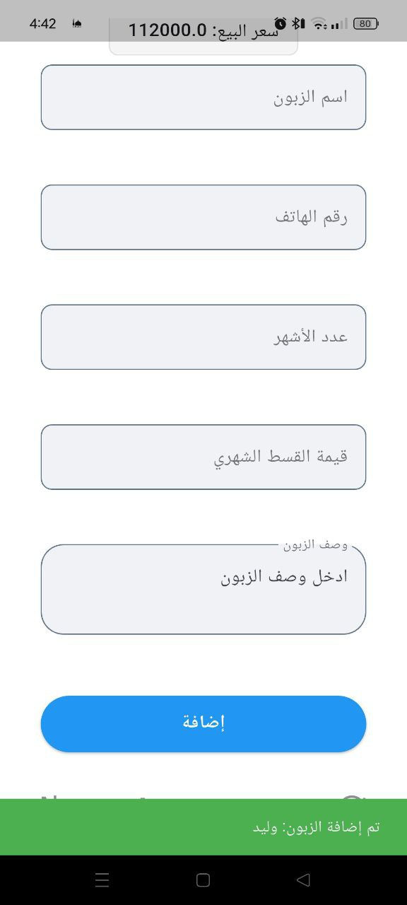
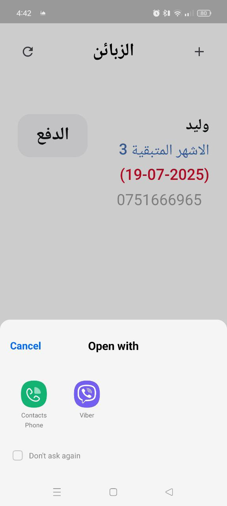
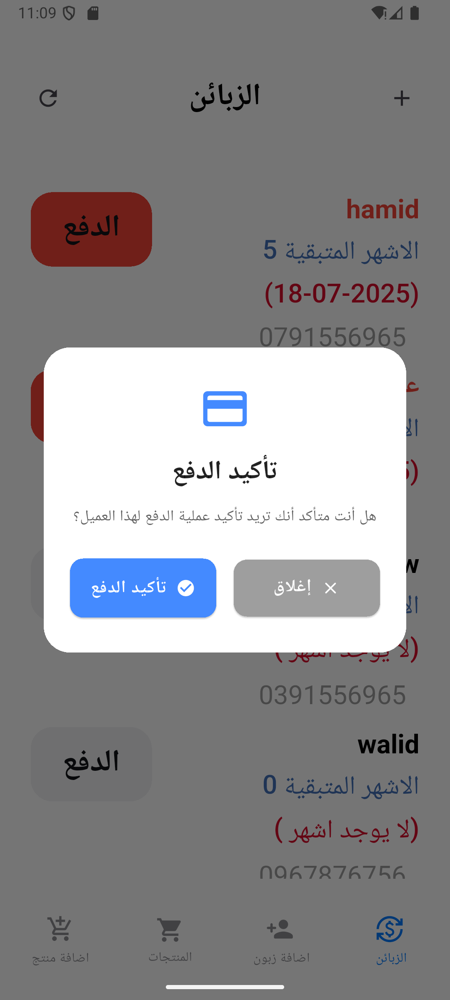

# Taksit Walid

A Flutter application for managing customer payments, products, and installments. This app helps businesses track customer purchases and manage payment installments efficiently.

## 🌟 Features

- **Customer Management**
  - Add new customers
  - View customer list
  - Track customer payment history
  - auto generate in real time the monthly payement tranch by entering ther number of month to complete the     payement 
- **Product Management**
  - Add new products
  - Manage product inventory
  - Product listing and details
  - auto  generate in real time the product sell price from  a purshase price by adding the 60% 

- **Payment Tracking**
  - Set up installment plans
  - Track payment schedules
  - Monthly payment monitoring

  ## 📱 Screenshots

  ## Add Product
  <p float="left">
    
    
    
  </p>

  ## Product List
  <p float="left">
    
  </p>

  ## Add Customer
  <p float="left">
    
    
    
    
  </p>

  ## Customer List
  <p>
    
    
    
    
    
    
    
    
  </p>

## 🚀 Getting Started

### Prerequisites

- Flutter SDK (^3.8.1)
- Dart SDK
- Android Studio / VS Code
- Git

### Installation

1. Clone the repository
```bash
git clone https://github.com/youcef-salem/taksit_walid
```

2. Navigate to project directory
```bash
cd taksit_walid
```

3. Install dependencies
```bash
flutter pub get
```

4. Run the app
```bash
flutter run
```

## 📦 Dependencies

- **provider**: ^6.1.5 - For state management
- **sqflite**: ^2.4.2 - Local database management
- **persistent_bottom_nav_bar_v2**: ^6.0.1 - Navigation bar
- **intl**: ^0.20.2 - Internationalization and formatting
- **url_launcher**: ^6.3.1 - URL handling
- **flutter_launcher_icons**: ^0.14.4 - App icon customization

## 📁 Project Structure

```
lib/
├── controllers/         # Business logic and state management
├── model/              # Data models
├── services/           # Database and API services
├── utilities/          # Helper functions and constants
├── view/              # UI screens
├── widgets/           # Reusable UI components
└── main.dart          # Application entry point
```

## 🗄️ Database Schema

The application uses SQLite database through `sqflite` package for local data storage.

product : [   id INTEGER PRIMARY KEY AUTOINCREMENT,
            productName TEXT,
            productPrice REAL,          
            buy_Price REAL,
            productDescription TEXT]
cutumer : [
  id INTEGER PRIMARY KEY AUTOINCREMENT,
            name TEXT,
            description TEXT,
            numerMonth INTEGER,
            phone_number TEXT,
            monthlyPayment REAL,
            productName TEXT,
            buy_Price REAL,
            productPrice REAL,
            productDescription TEXT
]
and  seperte tavle for months by id : 
[id INTEGER PRIMARY KEY AUTOINCREMENT,
            customer_id INTEGER,
            deadligne TEXT,
            numner_of_pay INTEGER,
            time_payment TEXT,
            is_payed INTEGER DEFAULT 0,
            FOREIGN KEY (customer_id) REFERENCES customers (id)]           

## 🛠️ Configuration

The app can be configured through various parameters in the `pubspec.yaml` file.

## 🤝 Contributing

Contributions are welcome! Please feel free to submit a Pull Request.


## 📞 Support

For support, email [salmywsf964@gmail.com]

## 🙏 Acknowledgments

- Flutter team for the amazing framework
- All contributors who helped with the project
